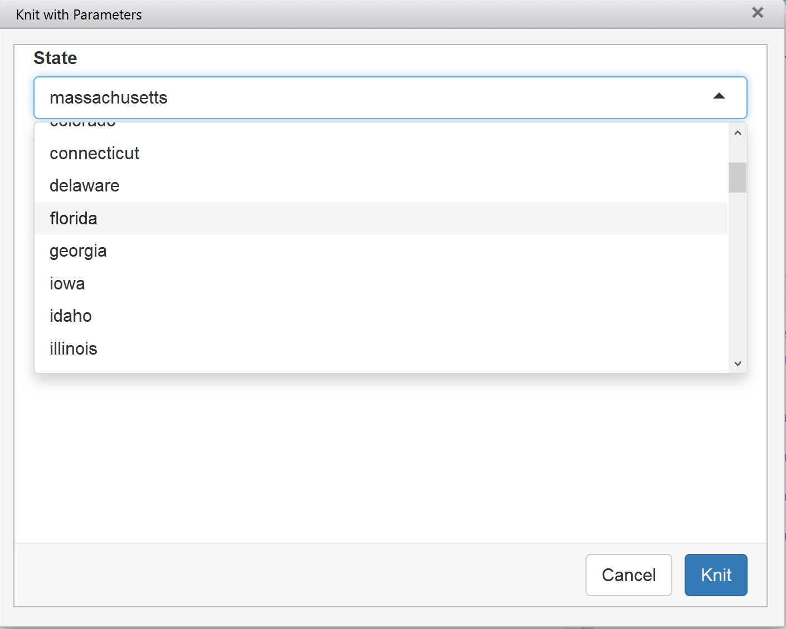

# N741 - Interactive tools - htmlwidgets, flexdashboard, knitting with parameters & bootstrapping

## `htmlwidgets` for R 

See **"htmlwidget_DTdemo.Rmd"**

`htmlwidgets` allows you to utilize JavaScript data visualization methods to enhance your reports and results displays. To learn more, see [http://www.htmlwidgets.org/index.html](http://www.htmlwidgets.org/index.html)

To see the interactive HTML widgets example using the Pesticide dataset, go to [https://cdn.rawgit.com/melindahiggins2000/N741interactive/master/htmlwidget_DTdemo.html](https://cdn.rawgit.com/melindahiggins2000/N741interactive/master/htmlwidget_DTdemo.html).

## `flexdashboard`

See **"flexdashboard_demo2.Rmd"**

`flexdashboard` is a R package you install to publish groups of data visualizations together. These visualizations can be static or dynamic. The example shown in this example using the Pesticides dataset is static, but dynamic examples use `shiny`. Learn more at [http://rmarkdown.rstudio.com/flexdashboard/](http://rmarkdown.rstudio.com/flexdashboard/).

To see today's example for the interactive `flexdashboard` with the Pesticides dataset go to [https://cdn.rawgit.com/melindahiggins2000/N741interactive/master/flexdashboard_demo2.html](https://cdn.rawgit.com/melindahiggins2000/N741interactive/master/flexdashboard_demo2.html).

## Knit with Parameters

See **"parametersTemplate.Rmd"**

Learn more about the `params` feature at [http://rmarkdown.rstudio.com/developer_parameterized_reports.html](http://rmarkdown.rstudio.com/developer_parameterized_reports.html).

This basically consists of adding the `params` option to your YAML code at the top of the RMD (`Rmarkdown`) file. Once this feature is added, the arguments can be passed by calling `rmarkdown::render()` and setting the options to what you want. However, once the YAML is setup, a list of choices for the `params` option can be provided and when you click "Knit with parameters" a GUI window pops-up with a pull down list (or other selection types) and you can pick which parameter setting you want for your customized report. See the screen shot of this GUI for the demo below.

See today's example with "knit with parameters" see [https://cdn.rawgit.com/melindahiggins2000/N741interactive/master/parametersTemplate.html](https://cdn.rawgit.com/melindahiggins2000/N741interactive/master/parametersTemplate.html).

## Boostrapping

See **"bootstrapping.Rmd"**

Bootstrapping example [https://cdn.rawgit.com/melindahiggins2000/N741interactive/master/bootstrapping.html](https://cdn.rawgit.com/melindahiggins2000/N741interactive/master/bootstrapping.html).

## Working with Tables

See **"xxxxxxxx.Rmd"**

Making well formatted tables in `Rmarkdown` can be challenging. A few good  overviews on making tables (and figures) in `Rmarkdown` are:

* [http://kbroman.org/knitr_knutshell/pages/figs_tables.html](http://kbroman.org/knitr_knutshell/pages/figs_tables.html)
* [https://www.r-bloggers.com/fast-track-publishing-using-knitr-table-mania-part-iv/](https://www.r-bloggers.com/fast-track-publishing-using-knitr-table-mania-part-iv/)
* [http://rmarkdown.rstudio.com/lesson-7.html](http://rmarkdown.rstudio.com/lesson-7.html)

Other R packages that can help make formatted tables:

* [https://cran.r-project.org/web/packages/tableone/vignettes/introduction.html](https://cran.r-project.org/web/packages/tableone/vignettes/introduction.html)
* [http://rapport-package.info/](http://rapport-package.info/)
* [http://davidgohel.github.io/ReporteRs/](http://davidgohel.github.io/ReporteRs/) & [https://cran.r-project.org/web/packages/ReporteRs/index.html](https://cran.r-project.org/web/packages/ReporteRs/index.html)

TODAY'S EXAMPLE - see today's table example at

